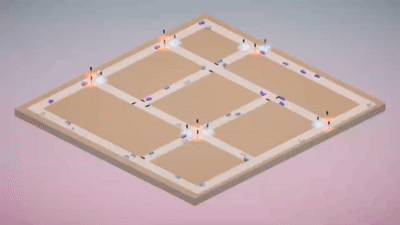

# LTLf Traffic Simulation - Master's Thesis Case Study

  

This project is a case study for the Master's Thesis:
**Synthesis of Reactive FSM from Temporal Specifications**.

**Author:** Galardo Emanuele \
**Institution:** University of Calabria \
**Master Degree** Artificial Intelligence and Data Science \
**Academic Year:** 2025/2026

## Overview
This repository contains a dynamic traffic simulation where the traffic lights are not controlled by standard timers. Instead, the intersections are managed by a **Reactive Finite State Machine (FSM)** synthesized from temporal logic specifications (LTLf).

The Automaton continuously analyzes the state of the incoming traffic in real-time, intelligently deciding on which pair of intersecting roads (North-South or East-West) to grant the green light. This ensures a strictly reactive environment that optimizes flow based on actual road conditions rather than static delays.

## Key Features
- **FSM-Driven Traffic Lights**: Intersection behavior is dictated entirely by a synthesized Automaton.
- **Reactive Environment**: The system reads vehicle queues and presence dynamically, adapting the traffic light phases.
- **Accessible UI Design**: Traffic light components are rendered in high-contrast Vermilion and Cyan to ensure perfect readability for color-blind users.

---

### Credits
*This simulator is a fork of the original [Unity Traffic Simulation](https://github.com/mchrbn/unity-traffic-simulation) project.*